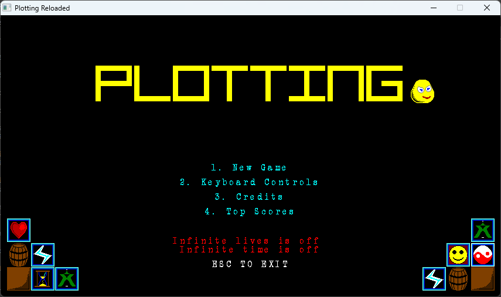
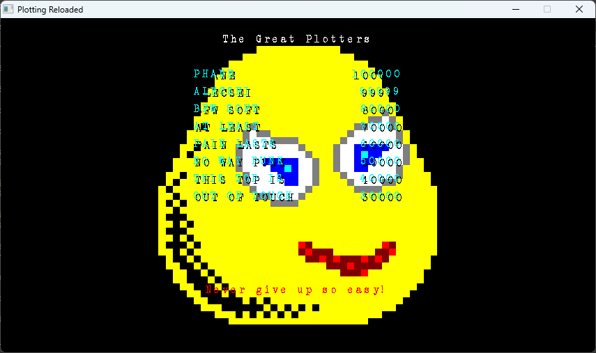
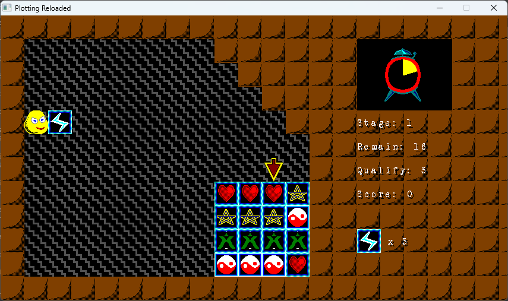
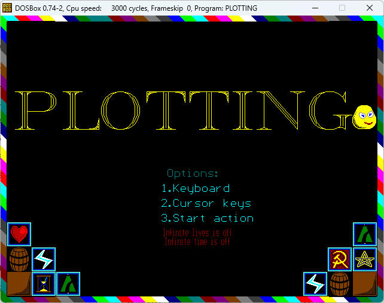
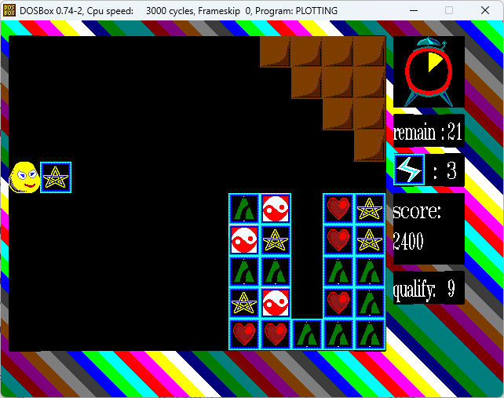

# Plotting

Welcome to Plotting, a remake of Plotting/Flipull.

It keeps most of the original game features, the only major difference is it replaces the "power" system with a timer system.

The remake was created in 1992-1993 and written in Turbo Pascal. It was our (myself and Alex Mazilu) first (almost) complete game for x86 PC.

Only 8 levels exist so far.

In 2007, the remake was ported to SDL 1.2 and made to work with the Free Pascal compiler.

In 2024, the SDL version was further improved (bug fixes, added sound, save/load configuration, etc)

You can read more about the history behind this remake here: https://www.pirongames.com/nostalgia-the-first-game/

## License

Code license:
https://opensource.org/licenses/MIT

Graphics license:
https://creativecommons.org/licenses/by-nc-sa/4.0/

Sound fx licenses:
See the each wav file license on freesound.org

## Setup&Install&Build (FPC version)
Instructions are for Windows systems.

Install Free Pascal Compiler. Version 3.2.2 was used.

Run build_plotting.bat to build and run the game.

SDL 1.2 DLLs are provided. Feel free to use your own or build them from sources.

Make_Levels.pas is used to create the levels files (data\Levels). Edit then run build_make_levels.bat

Make_Top.pas is used to reset the highscores file (data\Highscores) to default. Run build_make_top.bat to build and run.

## Setup&Install&Build (original version)
This exists solely as a frozen-in-time moment. It's interesting to see how I wrote code 30+ years ago.

It may be built using fpc -Mtp flag (compatibility with Turbo/Borland Pascal).

## Cheats
Open settings.json and locate the section "cheats".

These are:
* "freeze": infinite time;
* "blast": infinite lives;
* "spacewarp": starting level.

## TODO
* Smoother tile movement;
* Add more levels;
* Music support;
* True full-screen (might need porting to SDL 2).

## Screeshots

Latest version:

Original version:

